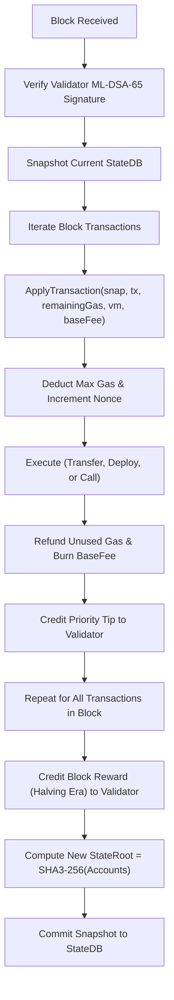

# Developer Note 02: Core Blockchain Architecture & Tokenomics

## 1. Why QubitsCoin Core Architecture Was Chosen

Traditional blockchains suffer from high gas fees, slow finality, and vulnerability to quantum computers:
- **Bitcoin/Ethereum 1.0**: High volatility in transaction fees, vulnerable to Shor's algorithm on ECDSA.
- **Solana**: High throughput but fragile validator consensus and high hardware requirements.
- **QubitsCoin Core Goal**: Combine sub-cent transaction fees (< \$0.000000021 at genesis), 2-second deterministic block finality, EIP-1559 base fee burning, and post-quantum ML-DSA-65 cryptography into a pure Go blockchain engine.

---

## 2. How the Core State Transition Works

### Block Processing Flow
Each block is executed through `internal/state/block_processor.go` (`ApplyBlock`):

---

## 3. Dynamic Fee Market (EIP-1559 Mechanism)

QubitsCoin uses an EIP-1559 elastic block model to prevent network spam while guaranteeing stable fees:

- **Target Gas per Block**: $15,000,000$ gas units (`TargetBlockGas()`).
- **Maximum Gas per Block**: $30,000,000$ gas units (`BlockGasLimit`).
- **Adjustment Algorithm** (`NextBaseFee` in `internal/core/fee.go`):
  - When actual gas used equals the target:
    $$\text{NextBaseFee} = \text{CurrentBaseFee}$$
  - When block gas is above target (network congestion):
    $$\text{over} = \text{gasUsed} - \text{target}$$
    $$\Delta = \frac{\text{current} \cdot \text{over}}{\text{target} \cdot 8}$$
    $$\text{NextBaseFee} = \text{current} + \min(\Delta, \text{maxDelta})$$
  - When block gas is below target (idle network):
    $$\text{under} = \text{target} - \text{gasUsed}$$
    $$\Delta = \frac{\text{current} \cdot \text{under}}{\text{target} \cdot 8}$$
    $$\text{NextBaseFee} = \max(\text{current} - \Delta, \text{MinBaseFee})$$

### Fee Burning & Deflationary Invariant:
$$\text{BurnedFee} = \text{gasUsed} \cdot \text{baseFee}$$
$$\text{ValidatorTip} = \text{gasUsed} \cdot (\text{tx.GasPrice} - \text{baseFee})$$
The base fee is permanently **burned** (removed from circulating supply), while only the tip and block subsidy are awarded to the validator.

---

## 4. Tokenomics & Halving Schedule

- **Native Unit**: $1 \text{ QBC} = 1,000,000,000 \text{ qubits}$ ($10^9$).
- **Maximum Supply Cap**: $100,000,000 \text{ QBC}$ (hard-coded ceiling).
- **Initial Block Reward**: $45 \text{ QBC}$ per block for Era 0.
- **Halving Interval**: $1,051,200$ blocks ($\approx 2 \text{ years}$ at 2s block intervals).
- **Halving Formula** (`BlockReward` in `internal/core/tokenomics.go`):
  $$\text{Era} = \frac{\text{Height}}{1,051,200}$$
  $$\text{Reward}(\text{Height}) = \frac{45 \cdot 10^9}{2^{\text{Era}}}$$
  After Era 32, the reward automatically steps to zero, and the network relies purely on validator transaction tips.
